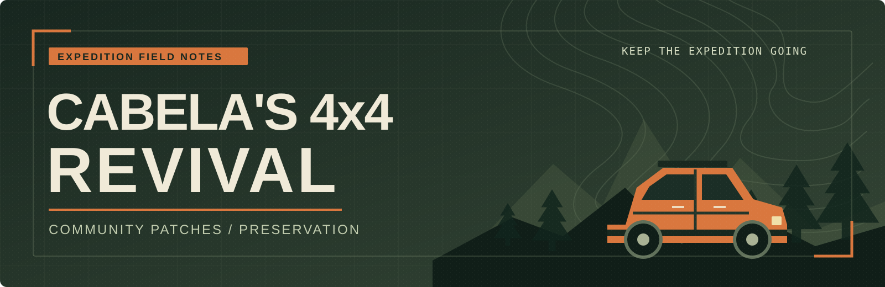

<p align="center">
  
</p>

<p align="center">
  
  
  
  
</p>

<p align="center">
  <strong>Keep the expedition going.</strong><br>
  Small, documented fixes for <em>Cabela's 4x4 Off-Road Adventure</em>.
</p>

---

## The first repair

**Community patch 1.2.1 fixes an original depth-buffer boundary error in the official English 1.2 executable.** A visual effect projected onto the first row beyond the bottom of the screen could make the game read outside its depth buffer and crash. The same mistake exists at the right edge.

The fix changes two conditional-branch bytes. Interior screen coordinates keep their existing behavior; out-of-screen coordinates take the game's existing “do not draw this effect” path.

| Field report | Result |
|---|---|
| Captured crash | Pixel row `1800` on a `2880 × 1800` screen; valid rows end at `1799` |
| Root cause | Original bounds checks allowed coordinates equal to width or height |
| Fix | Reject equality at both edges before accessing the depth buffer |
| Offline validation | Actual x86 routine replay: [**61 case pairs, 177 checks**](docs/verification/v1.2.1-replay.json) |
| Gameplay validation | **Pending**; the game and its graphics driver were not launched for verification |

Read the [forensic report](docs/forensics/depth-buffer-bounds.md), [fix specification](fixes/001-depth-buffer-bounds/README.md), and [known issues](docs/known-issues.md).

## Install

You need your own copy of the game, the **official English 1.2 executable**, and **Python 3.9 or newer** on Windows. Close the game before applying or rolling back a patch.

Download and extract the [latest release](../../releases/latest), open a terminal in the extracted project folder, and run:

```powershell
python src/patcher.py apply --game-dir "C:\Games\Cabela4x4"
python src/patcher.py verify --game-dir "C:\Games\Cabela4x4"
```

Replace the example folder with the folder containing `4x4 Adventure.exe`. The patcher checks the executable's SHA-256 against the supported baseline before changing it and retains a backup for rollback. An unknown executable needs a separate reviewed manifest.

To restore the pre-patch executable:

```powershell
python src/patcher.py rollback --game-dir "C:\Games\Cabela4x4"
```

### Supported baseline

| Executable | Version | SHA-256 |
|---|---|---|
| `4x4 Adventure.exe` | Official English 1.2 | `e9c5d3932dc87accd8a1d94a264de1badbe7edac73afaf1fa78181a30c624d1c` |

The version number alone is insufficient: different releases or other modifications can produce different binaries. See the machine-readable [manifest](fixes/001-depth-buffer-bounds/manifest.json) for the exact supported bytes and resulting hash.

## Inside the project

```text
cabelas-4x4-revival/
├── src/
│   └── patcher.py                 Apply, verify, and roll back reviewed fixes
├── fixes/
│   └── 001-depth-buffer-bounds/
│       ├── manifest.json          Exact baseline, byte edits, and hashes
│       └── README.md              Fix scope and installation details
├── docs/
│   ├── forensics/
│   │   └── depth-buffer-bounds.md  Evidence and causal analysis
│   ├── verification/
│   │   └── v1.2.1-replay.json      Machine-code replay results
│   └── known-issues.md            Remaining renderer questions
├── tests/                         Patcher and boundary regression checks
├── assets/
│   └── banner.svg                 Original project artwork
├── .github/                       Automated project checks
├── CHANGELOG.md
├── CONTRIBUTING.md
├── LICENSE
└── pyproject.toml
```

## What “Revival” means here

Each fix starts with a concrete failure, identifies the responsible layer, and records its smallest defensible correction. A modern graphics wrapper may make an old defect easier to observe; that does not automatically make the wrapper responsible, or prove the game could never have failed on its original operating systems.

This release addresses the demonstrated boundary error. Further compatibility work is tracked in [known issues](docs/known-issues.md). The goal is a useful, reviewable preservation project with honest validation records.

## Help improve it

Reports with an exact executable hash, exception address, graphics-wrapper version, and reproduction steps are especially useful. Please read [CONTRIBUTING.md](CONTRIBUTING.md) before submitting evidence or a patch.

Project code and original project artwork are available under the [MIT license](LICENSE). The game, official executable, game assets, and third-party wrappers retain their respective rights. Releases contain the patch tools and documentation; obtain the game separately.

*An independent community project. Community version 1.2.1 builds on official game version 1.2.*
